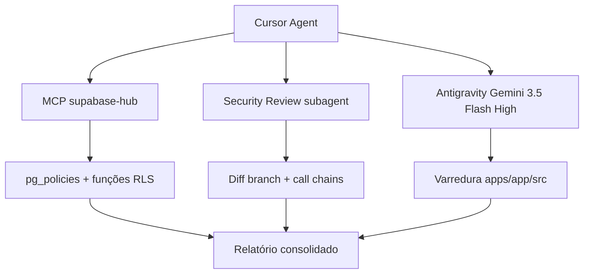
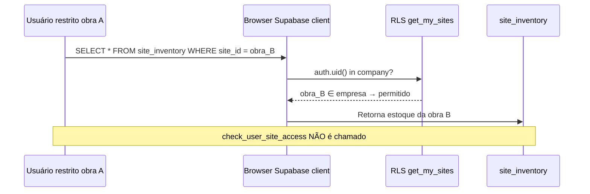

# Auditoria de Cibersegurança e LGPD — ObraLog ERP

[Voltar ao índice](./auditoria-obralog-indice.md) ·
[Segurança Backend (pendências)](./auditoria-seguranca-backend.md)

**Data:** 23 de junho de 2026  
**Escopo:** `apps/app` + políticas RLS do projeto Supabase **ObraLog**
(`hjkrlqualrkxymnndltw`)  
**Método:** análise manual, MCP `supabase-hub` (SQL em `pg_policies` e funções
RLS), subagente **Security Review** (diff da branch), subagente **Antigravity**
(Gemini 3.5 Flash High via IDE Bridge)

---

## Resumo executivo

| Métrica                       | Valor                                                |
| ----------------------------- | ---------------------------------------------------- |
| **Classificação geral**       | **Alto risco** para produção multi-tenant pública    |
| Achados críticos              | 2                                                    |
| Achados altos                 | 9                                                    |
| Achados médios                | 12                                                   |
| Achados baixos / informativos | 8                                                    |
| Conformidade LGPD estimada    | **~25%** (infra técnica parcial; governança ausente) |

**Principais conclusões:**

1. **RLS tem falha estrutural de escopo por obra:** a função `get_my_sites()`
   retorna _todas_ as obras da empresa, sem aplicar `check_user_site_access`.
   Tabelas operacionais (`site_inventory`, `tool_loans`, `epi_withdrawals`,
   etc.) dependem dela — um usuário restrito a uma obra pode ler e mutar dados
   de outras obras via cliente Supabase no browser.
2. **`globalUsers.ts` continua sendo o maior buraco de aplicação:** cookie
   `selectedCompanyId` sem `getValidatedCompanyId()` + `supabaseAdmin` permite
   cross-tenant (listar usuários de outra empresa) e
   `toggleGlobalUserStatusAction` não autentica nem autoriza o caller.
3. **Políticas RLS de escrita usam permissão mínima para operação `ALL`:** quem
   tem `view` em `usuarios` ou `perfis` pode deletar/alterar via SQL direto;
   quem tem `create` em `colaboradores`/`insumos` idem.
4. **LGPD:** o sistema armazena CPF, RG, endereço completo e documentos de
   colaboradores sem política de privacidade, consentimento, retenção, exclusão
   do titular nem DPA documentado com o processador (Supabase).
5. **Frontend:** sem CSP/headers de segurança; cookies de tenant manipuláveis no
   client; uploads com `getPublicUrl` para documentos sensíveis; proteção de
   rota de obra só no client (`ObraProtectedRoute`).

**Prioridade imediata (P0):** corrigir `get_my_sites()`, padronizar
`globalUsers.ts`, fechar `toggleGlobalUserStatusAction`, amarrar `inventoryId` ↔
`siteId`, separar políticas RLS por `cmd` e ação RBAC.

---

## Status da remediação (24/06/2026)

| ID / tema | Status | Evidência |
| --------- | ------ | --------- |
| SEC-01, 07–09, 26–29 (RLS) | **Implementado** | `supabase/migrations/20260624030000_security_rls_hardening.sql` aplicada |
| SEC-02–06, 11–12, 22–23 (actions) | **Implementado** | `globalUsers.ts`, `_helpers.ts`, IDOR em inventory/tools/epis/rented |
| SEC-10 (Storage privado) | **Implementado** | `20260624040000_private_storage_buckets.sql`, `documentStorageActions.ts` |
| SEC-13–14, 20 (proxy/cookies) | **Implementado** | `proxy.ts`, `tenantActions.ts`, `obras/[id]/layout.tsx` |
| SEC-15 (Zod actions) | **Implementado** | Rollout nas server actions principais + `loginAction` |
| SEC-16–19 (LGPD) | **Parcial → alto** | `/privacidade`, `/termos`, mascaramento CPF, export/anonymize, docs `docs/lgpd/`, aviso no login |
| SEC-21, 24–25, 31 | **Implementado** | `next.config.ts`, `exportUtils.ts`, `safeLog.ts`, E2E env-only |
| SEC-17 (consentimento) | **Implementado** | Links política/termos no login |
| P1.4 (forms RHF+Zod) | **Implementado** | Forms de obra com `zodResolver`; `AddSiteCollaboratorForm` ainda useState |
| Testes + CI | **Implementado** | Vitest 23 testes, `e2e/security.spec.ts`, `.github/workflows/app-ci.yml` |
| Build produção | **OK** | `npm run build` verde em 24/06/2026 |

**Pendências residuais (não bloqueantes):** criptografia de CPF em repouso (pgcrypto opcional); pentest externo; DPO revisar textos legais; hooks de leitura ainda usam `createClient()` no browser (padrão existente do app).

---

## Metodologia

- **19 tabelas** em `public` com `rowsecurity = true`.
- **57 políticas** RLS inspecionadas via `pg_policies`.
- **0 buckets** Storage configurados no banco no momento da auditoria (código já
  referencia `collaborator-documents`).
- Nenhum uso de `dangerouslySetInnerHTML`, `localStorage` ou `sessionStorage`
  para dados sensíveis encontrado.

---

## Achados consolidados

### Críticos

| ID         | Categoria  | Localização                                       | Descrição                                                                                                                                                                                                                                                                                                                | Recomendação                                                                                                                                 | Esforço |
| ---------- | ---------- | ------------------------------------------------- | ------------------------------------------------------------------------------------------------------------------------------------------------------------------------------------------------------------------------------------------------------------------------------------------------------------------------ | -------------------------------------------------------------------------------------------------------------------------------------------- | ------- |
| **SEC-01** | RLS        | Função `get_my_sites()` + 9 tabelas filhas        | `get_my_sites()` = `SELECT id FROM construction_sites WHERE company_id IN (get_my_companies())`. **Não** chama `check_user_site_access`. Usuário com perfil restrito a obra A acessa inventário, EPIs, empréstimos e movimentações de obras B/C via hooks (`useMovimentacoes`, `useToolHistory`, `useEPIHistory`, etc.). | Reescrever: `get_my_sites()` deve intersectar membership + `check_user_site_access(auth.uid(), id)`. Aplicar migration e testar cada tabela. | G       |
| **SEC-02** | API / Auth | `globalUsers.ts:177-235` (`getGlobalUsersAction`) | Usa `supabaseAdmin` (ignora RLS) lendo só cookie `selectedCompanyId`, **sem** `getAuthenticatedUserId()` nem `getValidatedCompanyId()`. Cross-tenant: listar e-mails, nomes e papéis de usuários de empresa alheia.                                                                                                      | Exigir sessão + tenant validado + `assertCompanyResourcePermission(..., 'usuarios', 'view')`. Preferir client com RLS.                       | P       |

### Altos

| ID         | Categoria      | Localização                                                                   | Descrição                                                                                                                                      | Recomendação                                                                                                                            | Esforço |
| ---------- | -------------- | ----------------------------------------------------------------------------- | ---------------------------------------------------------------------------------------------------------------------------------------------- | --------------------------------------------------------------------------------------------------------------------------------------- | ------- |
| **SEC-03** | API            | `globalUsers.ts:302-332` (`toggleGlobalUserStatusAction`)                     | Nova action: sem auth do caller, sem permissão `delete`, sem validação de membership. Alterna `ACTIVE`/`INACTIVE` via service role.            | `getAuthenticatedUserId` + `getValidatedCompanyId` + `assertCompanyResourcePermission(..., 'delete')`; impedir lockout do último admin. | P       |
| **SEC-04** | API            | `globalUsers.ts:47-131` (`saveGlobalUserAction`)                              | Parâmetro `isCompanyAdmin` vem do cliente → define `company_users.role` (`ADMIN`). Escalação de privilégio invocando a action diretamente.     | Ignorar flag do client; só ADMIN existente pode promover; validar alvo ∈ empresa.                                                       | M       |
| **SEC-05** | API            | `globalUsers.ts:78-86`                                                        | `user_metadata.temp_password` persiste senha provisória (visível em JWT/metadata).                                                             | Remover do metadata; fluxo de convite/reset; senha só one-time na resposta.                                                             | P       |
| **SEC-06** | API            | `inventoryActions.ts:36-39`                                                   | IDOR: `assertSiteAccess(siteId)` mas update em `site_inventory` só filtra `.eq('id', inventoryId)` — inventário de outra obra alterável.       | Pré-validar `site_id === data.siteId`; incluir `.eq('site_id', data.siteId)` no update.                                                 | P       |
| **SEC-07** | RLS            | `access_profiles_write_admin`, `company_users_write_admin`                    | Políticas `cmd = ALL` com `qual` exigindo apenas `view` no recurso. Usuário com view pode INSERT/UPDATE/DELETE.                                | Políticas separadas por `cmd`; `delete` exige `delete`, etc.                                                                            | M       |
| **SEC-08** | RLS            | `collaborators_write`, `catalogs_write`                                       | `cmd = ALL` com `create` como única checagem → delete/update liberados com só create.                                                          | Separar políticas INSERT/UPDATE/DELETE.                                                                                                 | M       |
| **SEC-09** | RLS            | `categories_*`                                                                | CRUD de categorias só verifica `company_id IN get_my_companies()` — **qualquer** membro da empresa, sem RBAC de `insumos`.                     | Aplicar `check_user_resource_permission` por operação.                                                                                  | M       |
| **SEC-10** | LGPD / Storage | `CollaboratorForm.tsx:198-208`, `AddRentedForm.tsx`                           | Upload direto do browser para `collaborator-documents` + `getPublicUrl` → URLs públicas para RG/CNH/documentos. Bucket sem políticas no banco. | Bucket privado + signed URLs + server action com validação; políticas Storage por `company_id`.                                         | G       |
| **SEC-11** | Auth           | `globalUsers.ts` (várias), `getCompanySitesAction`, `getUserSiteAccessAction` | Leituras admin sem `getValidatedCompanyId` / permissões; `getUserSiteAccessAction(userId)` aceita ID arbitrário.                               | Padronizar helpers em **todas** as actions.                                                                                             | M       |

### Médios

| ID         | Categoria | Localização                                            | Descrição                                                                                                                         | Recomendação                                                                               | Esforço |
| ---------- | --------- | ------------------------------------------------------ | --------------------------------------------------------------------------------------------------------------------------------- | ------------------------------------------------------------------------------------------ | ------- |
| **SEC-12** | AuthZ     | `_helpers.ts:104-159` vs `check_user_site_access` (DB) | App usa `allowed_sites` do perfil; RLS usa `user_site_access` + `obra_scope`. Modelos divergentes → bypass ou bloqueio incorreto. | Unificar: app e RLS na mesma fonte (`user_site_access` ∩ perfil).                          | G       |
| **SEC-13** | AuthZ     | `PermissionsContext.tsx`, `ObraProtectedRoute`         | `canAccessSite` só no client; middleware (`proxy.ts`) não valida membership nem obra.                                             | Validação server-side em layout de `/obras/[id]` + RLS corrigido.                          | M       |
| **SEC-14** | Auth      | `proxy.ts:64-70`                                       | Cookie `selectedCompanyId` só verifica existência, não membership em `company_users`.                                             | Validar UUID + membership antes de rotas `(app)`.                                          | M       |
| **SEC-15** | Auth      | `loginAction` (`auth.ts:8`)                            | `formData: any` sem Zod; sem rate limit / lockout.                                                                                | Schema Zod + mensagens genéricas; considerar Supabase Auth hooks.                          | P       |
| **SEC-16** | LGPD      | `collaborators` (DB + UI)                              | CPF, RG, nascimento, endereço completo em texto plano; CPF exibido em listagens (`colaboradores/page.tsx`).                       | Mascaramento na UI; criptografia em repouso para campos sensíveis; base legal documentada. | M       |
| **SEC-17** | LGPD      | Sistema inteiro                                        | Sem política de privacidade, termos, banner de cookies, registro de consentimento, canal de direitos do titular (Art. 18).        | Páginas legais + fluxo de solicitação + ROPA.                                              | G       |
| **SEC-18** | LGPD      | Supabase (US/EU)                                       | Transferência internacional de dados pessoais sem cláusulas contratuais documentadas (Art. 33–36).                                | DPA com Supabase + informar titulares.                                                     | M       |
| **SEC-19** | LGPD      | Ausência geral                                         | Sem política de retenção, anonimização pós-desligamento, nem exclusão automatizada de colaborador inativo.                        | Job de retenção + soft-delete + purge documentado.                                         | G       |
| **SEC-20** | Frontend  | Cookies client-side                                    | `selectedCompanyId` / `selectedObraId` setados via `document.cookie` sem `HttpOnly`/`Secure` em vários pontos.                    | Setar cookies sensíveis apenas no servidor (`httpOnly`, `secure`, `sameSite`).             | M       |
| **SEC-21** | Frontend  | Headers HTTP                                           | Sem CSP, `X-Frame-Options`, `X-Content-Type-Options`, `Referrer-Policy` em `next.config`.                                         | `headers()` no Next.js config.                                                             | P       |
| **SEC-22** | API       | `saveGlobalUserAction:94`                              | `listUsers()` sem paginação para achar e-mail existente — custo e vazamento de metadados em escala.                               | `getUserByEmail` admin API ou RPC.                                                         | P       |
| **SEC-23** | API       | `toolsActions.ts` (padrão)                             | Empréstimo de ferramenta pode não validar `inventoryId ∈ siteId` (mesma classe do SEC-06).                                        | Validar FK composta antes de insert.                                                       | P       |

### Baixos / informativos

| ID         | Categoria | Localização                | Descrição                                                                    | Recomendação                                |
| ---------- | --------- | -------------------------- | ---------------------------------------------------------------------------- | ------------------------------------------- |
| **SEC-24** | Export    | `exportUtils.ts`           | CSV sem neutralizar fórmulas (`=`, `+`, `@`) → CSV injection no Excel.       | Prefixar células suspeitas com `'`.         |
| **SEC-25** | Testes    | `e2e/smoke.spec.ts:3-4`    | Credenciais default `admin@obralog.com` / `123123`.                          | Só via env; nunca em produção.              |
| **SEC-26** | RLS       | `measurement_units`        | Só políticas INSERT e SELECT — UPDATE/DELETE negados (pode ser intencional). | Documentar ou adicionar políticas.          |
| **SEC-27** | RLS       | `site_epis`                | Sem política UPDATE explícita.                                               | Adicionar se necessário.                    |
| **SEC-28** | RLS       | Repositório                | Políticas não versionadas em `supabase/migrations`.                          | Exportar e revisar em PR.                   |
| **SEC-29** | AuthZ     | `profiles_read_all`        | Colegas da mesma empresa leem e-mail/nome de todos os perfis vinculados.     | Restringir campos ou usar view mascarada.   |
| **SEC-30** | DevOps    | `supabaseAdmin.ts:4`       | Service role com fallback `''` — falha em runtime, mas pattern frágil.       | Fail-fast no boot (já parcial).             |
| **SEC-31** | LGPD      | `console.error` em actions | Erros podem incluir contexto com PII em logs server.                         | Sanitizar logs; structured logging sem PII. |

---

## Análise detalhada — RLS (Supabase)

### Inventário de tabelas

Todas as 19 tabelas em `public` têm RLS habilitado.

### Funções auxiliares (resumo)

| Função                                | Comportamento                                                   | Risco                            |
| ------------------------------------- | --------------------------------------------------------------- | -------------------------------- |
| `get_my_companies()`                  | Empresas do `auth.uid()` em `company_users`                     | OK                               |
| `get_my_sites()`                      | **Todas** as obras das empresas do usuário                      | **CRÍTICO** — ignora escopo      |
| `check_user_site_access(uid, site)`   | ADMIN → true; `obra_scope=ALL` → true; senão `user_site_access` | OK isoladamente                  |
| `check_user_resource_permission(...)` | SUPER_ADMIN / ADMIN → true; senão JSON `permissions`            | OK; mal usado em políticas `ALL` |
| `is_company_member(cid)`              | Membership simples                                              | OK para leitura ampla            |

### Tabelas que aplicam escopo por obra corretamente

- `construction_sites` — SELECT/INSERT/UPDATE/DELETE usam
  `check_user_site_access` + RBAC.

### Tabelas que **não** aplicam escopo por obra (usam `get_my_sites`)

- `site_inventory`, `site_epis`, `site_movements`, `site_tools`,
  `site_collaborators`
- `epi_withdrawals`, `inventory_movements`, `tool_loans`, `rented_equipments`

### Políticas com granularidade RBAC incorreta

| Tabela            | Política                      | Problema                   |
| ----------------- | ----------------------------- | -------------------------- |
| `access_profiles` | `access_profiles_write_admin` | `ALL` + permissão `view`   |
| `company_users`   | `company_users_write_admin`   | `ALL` + permissão `view`   |
| `collaborators`   | `collaborators_write`         | `ALL` + permissão `create` |
| `catalogs`        | `catalogs_write`              | `ALL` + permissão `create` |
| `categories`      | `*_policy`                    | Só membership, sem recurso |

### Diagrama do bypass de obra

---

## Análise — Server Actions e service role

**Padrão correto (referência):** `getAuthenticatedUserId()` →
`getValidatedCompanyId()` → `assertCompanyResourcePermission` /
`assertSiteAccess` → mutação.

**Arquivos que usam `supabaseAdmin`:** 15+ action files. Uso legítimo
**somente** após validação de tenant e permissão.

**Actions com gap confirmado em `globalUsers.ts`:**

| Action                         |  Auth   | Tenant  |         Permissão         |
| ------------------------------ | :-----: | :-----: | :-----------------------: |
| `saveGlobalUserAction`         |   Sim   |   Sim   | Parcial (escalação admin) |
| `getGlobalUsersAction`         | **Não** | **Não** |          **Não**          |
| `getCompanySitesAction`        | Parcial | **Não** |          **Não**          |
| `getAllProfilesAction`         | Parcial | **Não** |         RLS only          |
| `getUserSiteAccessAction`      | Parcial | **Não** |          **Não**          |
| `toggleGlobalUserStatusAction` | **Não** | **Não** |          **Não**          |

---

## Análise — Frontend

| Verificação                             | Resultado                                    |
| --------------------------------------- | -------------------------------------------- |
| XSS (`dangerouslySetInnerHTML`, `eval`) | Não encontrado                               |
| Secrets no bundle (`NEXT_PUBLIC_*`)     | Apenas URL e anon key (esperado)             |
| `SUPABASE_SERVICE_ROLE_KEY` no client   | Não exposto                                  |
| Permissões só no client                 | Sim — `Can`, `ObraProtectedRoute`, sidebar   |
| Middleware auth                         | `proxy.ts` — login + cookie empresa presente |
| Uploads sensíveis                       | Client direto + URL pública potencial        |
| Importação CSV colaboradores            | Parse client-side sem validação forte de PII |

---

## Checklist LGPD (Art. 6–18)

| Artigo / Princípio                    | Status      | Observação                                              |
| ------------------------------------- | ----------- | ------------------------------------------------------- |
| Art. 6 — Finalidade                   | **Parcial** | Dados coletados para gestão de obra; falta documentação |
| Art. 6 — Adequação                    | **Parcial** | CPF/RG necessários para RH; documentos sem controles    |
| Art. 6 — Necessidade                  | **Não**     | Endereço completo + docs podem exceder o necessário     |
| Art. 6 — Transparência                | **Não**     | Sem aviso de privacidade na coleta                      |
| Art. 7 — Base legal / consentimento   | **Não**     | Sem fluxo de consentimento para colaboradores           |
| Art. 8 — Consentimento menor          | N/A         | —                                                       |
| Art. 9 — Direitos do titular          | **Não**     | Sem exportar/apagar dados do colaborador                |
| Art. 10 — Hipóteses sem consentimento | **Parcial** | Legítimo interesse possível; não formalizado            |
| Art. 14 — Crianças                    | N/A         | —                                                       |
| Art. 18 — Atendimento ao titular      | **Não**     | Sem canal DPO/privacidade                               |
| Art. 32 — Segurança                   | **Parcial** | RLS parcial; gaps críticos listados                     |
| Art. 33 — Comunicação incidente       | **Não**     | Sem playbook                                            |
| Art. 37 — ROPA                        | **Não**     | Sem registro de operações                               |
| Art. 41 — DPO                         | **Não**     | Não indicado                                            |
| Transferência internacional (Cap. V)  | **Não**     | Supabase sem DPA documentado no projeto                 |

---

## Quick wins (top 5)

1. **SEC-02 + SEC-03:** Corrigir `getGlobalUsersAction` e
   `toggleGlobalUserStatusAction` (1–2 h).
2. **SEC-05:** Remover `temp_password` de `user_metadata` (15 min).
3. **SEC-06:** Adicionar `.eq('site_id', data.siteId)` em
   `adjustInventoryStockAction` (15 min).
4. **SEC-21:** Headers de segurança básicos no `next.config.ts` (30 min).
5. **SEC-24:** Neutralizar CSV injection em `exportUtils.ts` (15 min).

---

## Roadmap de remediação sugerido

| Fase                       | Prazo       | Itens                                                                    |
| -------------------------- | ----------- | ------------------------------------------------------------------------ |
| **P0 — Bloqueadores**      | 1 semana    | SEC-01, SEC-02, SEC-03, SEC-04, SEC-06, SEC-07, SEC-08                   |
| **P1 — Hardening**         | 2–3 semanas | SEC-09, SEC-10, SEC-12, SEC-14, SEC-20, SEC-21, migration RLS versionada |
| **P2 — LGPD**              | 1–2 meses   | SEC-16 a SEC-19, SEC-17, ROPA, políticas legais, DPA Supabase            |
| **P3 — Melhoria contínua** | Contínuo    | SEC-24–31, testes de segurança automatizados, pentest                    |

---

## Referências cruzadas

- Pendências anteriores:
  [auditoria-seguranca-backend.md](./auditoria-seguranca-backend.md) (S11, S13,
  S5b, RLS1)
- Melhorias já feitas na maratona: `_helpers.ts`, `assertSiteAccess`, migração
  parcial de mutações
- Subagente Security Review: 7 achados medium/high validados no diff atual
- Antigravity (Gemini 3.5 Flash High, job `ef4588b2`): **falhou** por erro de
  workspace no IDE Bridge após varredura parcial; achados consolidados via MCP +
  Security Review + análise manual cobrem o escopo solicitado

---

## Nota legal

Este documento é uma **auditoria técnica interna**, não substitui parecer
jurídico para conformidade LGPD nem pentest certificado. Recomenda-se revisão
por DPO/advogado antes de go-live com dados reais de colaboradores.
