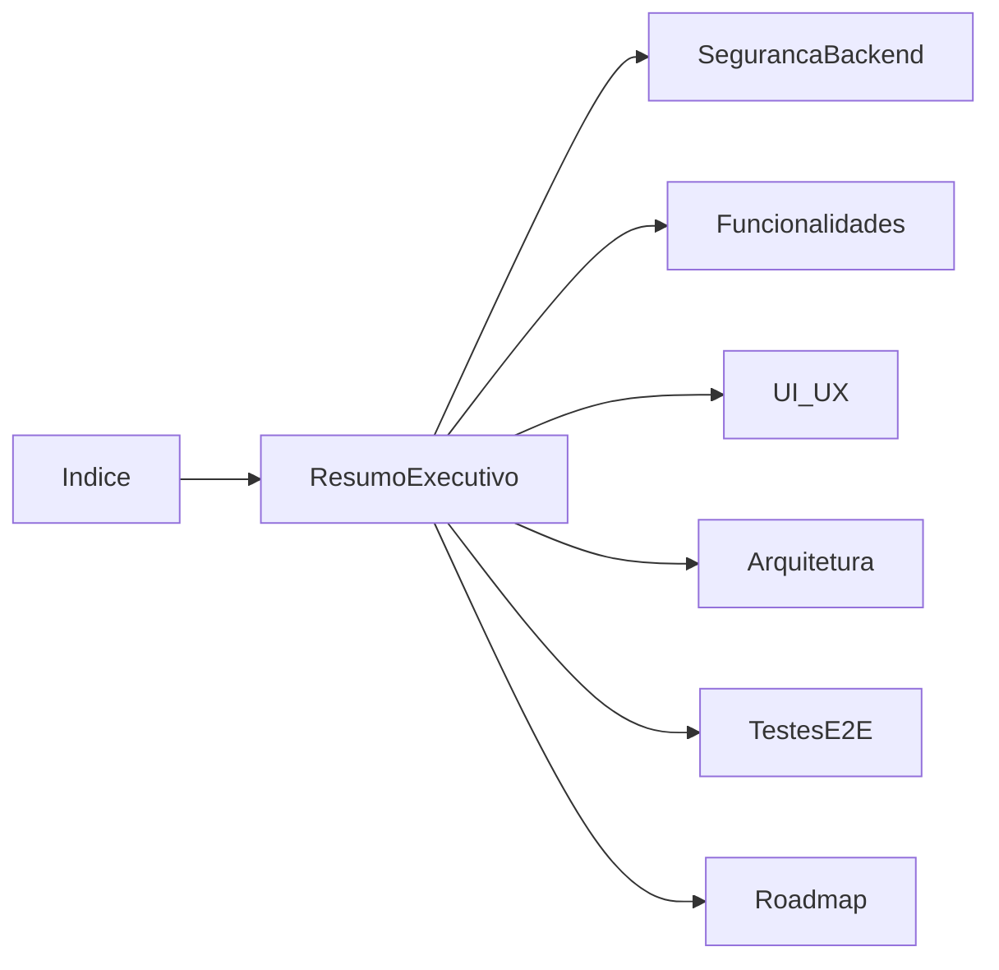

# Auditoria ObraLog ERP — Índice (pendências)

**Última atualização:** 23 de junho de 2026  
**Escopo:** `apps/app` (exclui `apps/admin`)  
**Contexto:** após maratona de melhorias P0–P2 (segurança, sidebar, actions, RBAC, exports, E2E smoke)

---

## Sobre estes documentos

Esta pasta documenta o **que ainda falta** no ObraLog ERP. Itens já implementados na maratona foram removidos dos relatórios.

**Já concluído na maratona (não listado abaixo):** middleware via `proxy.ts`, hardening de server actions, validação de `selectedCompanyId`, migração de mutações críticas para server actions, dashboard com dados reais, exports CSV, sidebar com contexto de obra persistente, `ConfirmDialog`, split de `adminActions`, `allowed_sites`, `ObraProtectedRoute`, breadcrumbs, redirects de rotas stub, smoke E2E Playwright, entre outros.

---

## Relatórios

| Documento | Público-alvo | Conteúdo |
|-----------|--------------|----------|
| [Resumo Executivo](./auditoria-resumo-executivo.md) | Gestão / PO | Estado atual, lacunas restantes, próximos passos |
| [Cibersegurança e LGPD](./auditoria-ciberseguranca-lgpd.md) | Segurança / DPO / Jurídico | **Auditoria completa** — RLS, API, frontend, LGPD (jun/2026) |
| [Segurança e Backend](./auditoria-seguranca-backend.md) | Backend / DevOps | Riscos residuais, Zod parcial, RLS, dados sensíveis |
| [UI/UX e Navegação](./auditoria-ui-ux-navegacao.md) | Design / Frontend | Forms de obra, a11y, tokens, UI morta |
| [Funcionalidades e Módulos](./auditoria-funcionalidades-modulos.md) | Produto / QA | Gaps CRUD, stubs, módulos inexistentes |
| [Arquitetura e Qualidade](./auditoria-arquitetura-qualidade.md) | Engenharia | God files, `any`, testes, performance |
| [Testes E2E](./relatorio-testes-e2e-erp.md) | QA | Cobertura atual e gaps de CI |
| [Roadmap Priorizado](./roadmap-melhorias-priorizado.md) | Todos | Apenas itens pendentes |

---

## Notas por dimensão (pós-maratona)

| Dimensão | Nota | Situação |
|----------|------|----------|
| Produto / escopo funcional | ~50% | Núcleo operacional ok; módulos clássicos ausentes |
| Arquitetura | ~55% | Actions modularizadas; ainda há god files e `any` |
| Segurança | **Alto** | Ver [auditoria cibersegurança/LGPD](./auditoria-ciberseguranca-lgpd.md); RLS `get_my_sites` crítico |
| UI/UX | ~70% | Sidebar e breadcrumbs ok; forms de obra e a11y pendentes |
| Qualidade de código | ~50% | ~35 arquivos >200 linhas; ~60 `any` |
| Navegação | ~85% | Sidebar unificada; rota órfã e busca fake |
| Testes automatizados | Baixo | Smoke E2E local; sem CI nem unitários |

---

## Stack

- **Frontend:** Next.js 16, React 19, TypeScript strict, Tailwind 4
- **Forms:** react-hook-form + zod (parcial — cadastros globais sim, modais de obra não)
- **Backend:** Supabase (Auth, PostgreSQL, Storage, RLS)
- **Padrão declarado:** Smart/Dumb, DDD por features, hooks para dados

---

## Leitura recomendada por perfil

**Product Owner:** Resumo Executivo → Funcionalidades → Roadmap P3

**Backend:** Segurança → Arquitetura → Roadmap (Zod rollout, RLS)

**Frontend:** UI/UX → Roadmap (P1.4, P2.6, P2.8)

**QA:** Testes E2E → Funcionalidades
